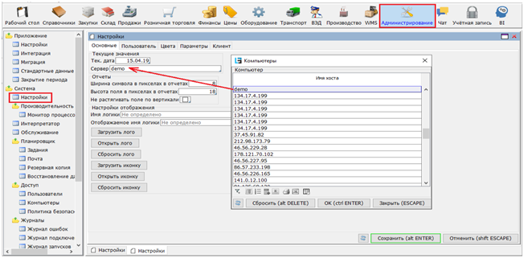
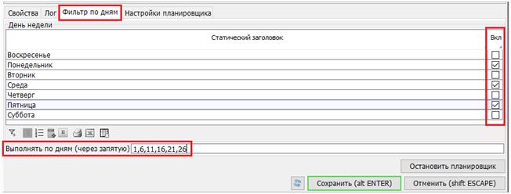

The scheduler is designed to automatically execute certain tasks with specified frequency.

The scheduler is configured in the Administration\\\\Scheduler\\\\Tasks menu. You can start the scheduler on this form by clicking «Start scheduler» button and stop it by clicking «Stop scheduler» (Fig. 7.11.). If the Server is specified in the system settings, then the scheduler can be launched from this server only (Fig. 1.).

Fig. 1. Specifying a server to run the scheduler

Fig. 2. Scheduler start/stop

This form determines the composition of Tasks – buttons «Add», «Delete».  The scheduler will execute only active Tasks – «Active» mark. For each task the following required parameters are set:

-   Start date – the task will be executed only after the specified date. The time in this field is not tied to the start date; it is tied to the current date and indicates the time of the first task launch within a day. The task repetition is counted from this time. The frequency is set in the «Repeat every (seconds)» field. If the period is more than a day (86400 seconds), then the starting date is the date of the server start (restart).
-   Repeat every (seconds) – the task execution frequency.
-   Countdown – indicates the time from which to count down the time for the repeated task: either «From the end of the previous» or «From the start of the previous».

Also, the optional parameters can be specified:

-   Time from/Time to – time limit for the task execution within 24 hours.
-   Execute at start – the task is performed only when the server is started (restarted).

For each task the following buttons are available:

-   «Execute task» - executes the task manually. The task runs immediately on the button click. If the task is not completed when the button is pressed, it will be launched twice.
-   «Restart task» - executes the task manually. The task runs immediately on the button click. If the task is not completed when the button is pressed, it will be stopped and restarted.
-   «Delete» - deletes the task.

Tabs on the «Tasks» form:

-   The «Properties» tab lists the actions included in the selected task. The sequence of actions is determined by the values in the «Order» field from the smallest to the largest. Only actions with the «Active» mark are executed. The «Ignore errors» mark allows you to run the action despite the error that occurred in the previous action, otherwise, the current action will not start. An action can be implemented either by built-in commands (the list of commands appears on clicking the «Action» field) or user-created scripts – the «Script» field. Some built-in actions require input parameters (usually numeric) which are entered in the «Action parameter» field. In the «Perform no longer than (seconds)» field the maximum acceptable duration for the execution of this action is indicated. If the action is not completed within the specified period, the system considers it an error.
-   On the «Log» tab the results of the action, when it started and finished, can be traced. If an error preventing the action from being completed has occurred during its execution, then it is marked in the «Error» field in the log. Some actions are accompanied by informational messages – mark in the «Messages» field. If the log has a mark in the «Error in messages» field, this means that during the execution inconsistencies with some of the program constraints were found. All errors and messages are followed by notes in the «Client messages» section (Fig. 3.).

Fig. 3. Scheduler log.

-   If the task is run once every few days, then on the «Filter by day» tab you can specify either the days of the week or days of the month on which the task should be started. If both the days of the week and days of the month are specified, then the task will be executed only on those days of the month that fall on the specified days of the week (Fig. 4.).

Fig. 4. Setting filter by day.

-   On the «Scheduler settings» tab the maximum number of threads (tasks) that can be executed simultaneously is specified. If the number of threads is not specified, then, by default, up to 5 tasks can be executed simultaneously.
